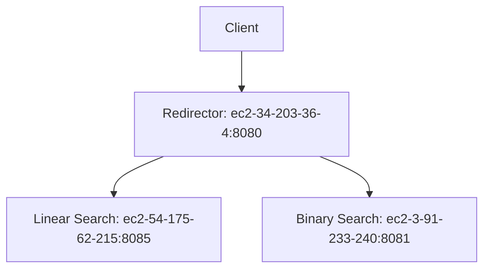

# Parcial AREP - Microservicios de Búsqueda

##  Arquitectura Empresarial| 2025

###  Descripción

Sistema distribuido que implementa dos microservicios de búsqueda (Linear Search y Binary Search) y un redireccionador central, desplegados en AWS EC2.

### Arquitectura



###  Tecnologías

- **Backend:**
  - Java 17 + Spring Boot
- **Infraestructura:**
  - AWS EC2 (Instancias Linux)
  - Maven (Gestión de dependencias)
- **Protocolos:**
  - HTTP/REST
  - SSH (Gestión remota)

###  Instalación

#### Requisitos

- Java 17
- Maven 3.8+
- Cuenta AWS (opcional para despliegue)

#### Ejecución Local

```bash
# Clonar repositorio
git clone https://github.com/murcia0421/Parcial2Arep.git

# Compilar (en cada módulo)
mvn clean package

# Ejecutar servicios (puertos predeterminados)
java -jar mathService1/target/mathService1-0.0.1-SNAPSHOT.jar  # Linear (8085)
java -jar mathService2/target/mathService2-0.0.1-SNAPSHOT.jar  # Binary (8081)
java -jar arep/target/arep-0.0.1-SNAPSHOT.jar                  # Redirector (8080)
```

### 🔌 Endpoints

| Servicio      | Endpoint                               | Ejemplo                          |
| ------------- | -------------------------------------- | -------------------------------- |
| Redirector    | GET /linearsearch?list={csv}&value={x} | /linearsearch?list=1,2,3&value=2 |
|               | GET /binarysearch?list={csv}&value={x} | /binarysearch?list=1,2,3&value=1 |
| Linear Search | GET /linearsearch?list={csv}&value={x} | Directo: :8085/linearsearch?...  |
| Binary Search | GET /binarysearch?list={csv}&value={x} | Directo: :8081/binarysearch?...  |

###  Despliegue AWS

1. Crear instancias EC2 (Amazon Linux 2023)
2. Configurar Security Groups (puertos 22, 8080, 8081, 8085)
3. Transferir JARs:

###  Videos

#### Video 1: Despliegue y funcionamiento


https://github.com/user-attachments/assets/29092914-2c46-4918-9985-7a78af503784

#### Video 2: Código y algoritmos funcionando


https://github.com/user-attachments/assets/7876846c-e148-41fd-9146-49507f2896e0


###  Autor
- **Juan Daniel Murcia**
- **GitHub:** [murcia0421](https://github.com/murcia0421)
